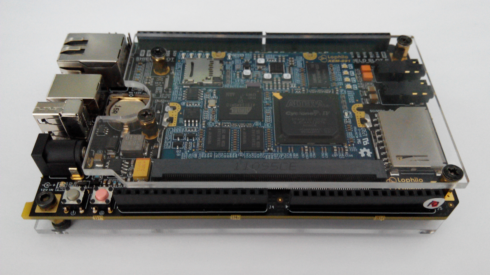

# The openFPGAduino User Manual

openFPGAduino is a open source hardware project.

The live demo

http://v.youku.com/v_show/id_XOTQ3MjkxNzU2.html?from=y1.7-1.2

https://www.youtube.com/watch?v=jsjrgsI-3QM

It includes a open source hardware platform with one core pcb, one motherbroad and sevial extention broad.
It also includes linux, broad driver, FPGA project, and IDE based on nodejs.
All of them are open source.

Official web site
http://openfpgaduino.github.io
Official source code site
https://github.com/OpenFPGAduino/OpenFPGAduino
