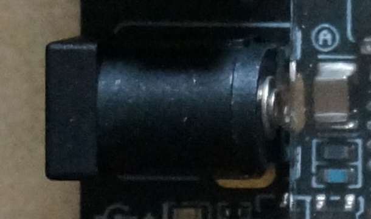
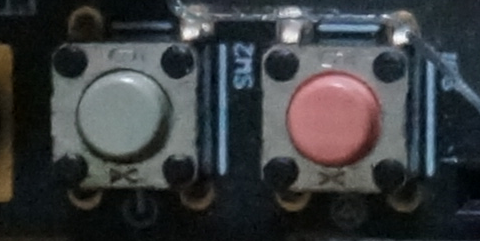
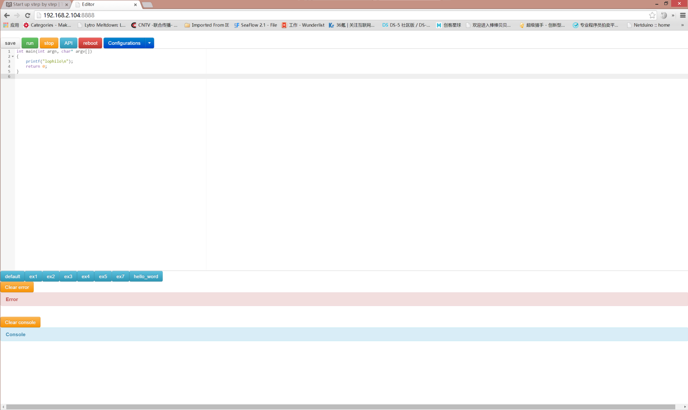
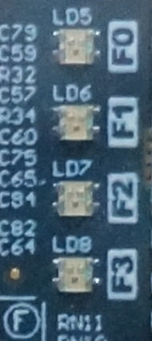
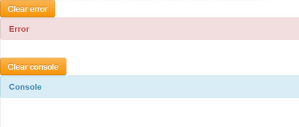

# Start up step by step
## 1 Plug in the power cable, usb and net cable


## 2 Press the power button.


Press the gray button to power on. Pink one is the reset button. After power on the usb device of the broad will be recognize as a serical port.

## 3 login the console
Download a putty software and connect the serial port, the bandrate is 115200.
 [www.putty.org](www.putty.org)

## 4 get the ip address from console
 Run ifconfig in shell console

  ```
root@hostname:~$ ifconfig
eth0     Link encap:Ethernet  HWaddr 48:02:2a:b6:0c:0a
          inet addr:192.168.2.109  Bcast:192.168.2.255  Mask:255.255.255.0
          UP BROADCAST RUNNING MULTICAST  MTU:1500  Metric:1
          RX packets:35765 errors:0 dropped:355449 overruns:0 frame:0
          TX packets:3800 errors:0 dropped:0 overruns:0 carrier:0
          collisions:0 txqueuelen:1000
          RX bytes:10828535 (10.8 MB)  TX bytes:703119 (703.1 KB)
lo        Link encap:Local Loopback
          inet addr:127.0.0.1  Mask:255.0.0.0
          UP LOOPBACK RUNNING  MTU:16436  Metric:1
          RX packets:153 errors:0 dropped:0 overruns:0 frame:0
          TX packets:153 errors:0 dropped:0 overruns:0 carrier:0
          collisions:0 txqueuelen:0
          RX bytes:12822 (12.8 KB)  TX bytes:12822 (12.8 KB)
```
The ip address of the broad is 192.168.2.109

## 5 get the ip address from router

  You can also get the ip address of the broad from you router in the DHCP servier-> client list
 ```
ID	客户端名	MAC 地址	IP 地址	有效时间
1	lizhizhdeiPhone	0C-3E-9F-55-39-23	192.168.2.100	01:47:32
2	lizhizhou	60-45-BD-E9-29-BA	192.168.2.104	01:29:52
3	miniand	48-02-2A-B6-0C-0A	192.168.2.109	01:41:03
4	android-d005d5d5cbb83cc9	00-24-25-0E-E7-C8	192.168.2.101	01:53:23
5	ubuntu	00-0C-29-38-00-E1	192.168.2.102	01:15:16

```
The ip address of the broad is 192.168.2.109

## 6 load the Arduino IDE from the browser
Open a brower and type the address:
http://(ip_addres_of_the_broad):8888

## 7 Load a configuration


Select the drop-down list, you can choose the configuration of the broad. The broad will program the fgpa program based on your choice.

## 8 Load a example


Pree the blue butten under the program editor. You can load a program which is saved previously.
The Ex1 example includes a RGB LED example.
```
int main(int argn, char* argv[])
{
    init();
    led(0, 255,0,0);
    led(1, 255,0 ,255);
    led(2, 0 ,255,255);
    led(3, 255,255,0);
    return 0;
}
```


## 9 Edit the code
Edit the code in the editor.

## 10 Check the api doc
Press the API button, you will see the API you can use in the program.

## 11 run the code
Press the run button, the program you write will download to the braod, compile and run in the broad.
See the RGB led change its color by your control.



## 12 check the output and error message
The compile error will display in the error label and you can currect it. The output of the program will display in the log label



## 13 Save the code
Press the save button and input the file name. The program you wirte will save in the broad. And the code can be load by using load example stage.

## 14 Extend the broad.
Comming soon
