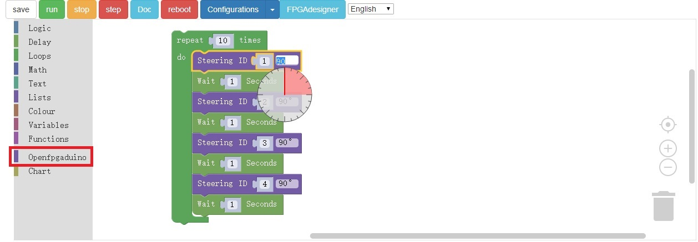

# The Robot Arm Demo

This section will show you how to control a robot arm through BlocklyIDE

The live demo:
https://www.youtube.com/watch?v=8sKebXHc7Xk&feature=youtu.be

The code snippet in BlocklyIDE:

The robot arm that this demo is using is a 4 axes one, which means there're four seperate steering motors to control its movement. You can see that OpenFPGAdunio provided customized widget in the Openfpgaduino toolbox for you to control the rotation angle of the steering motor. You can try it out by yourself on：http://openfpgaduino.github.io/blocklyide/index.html
