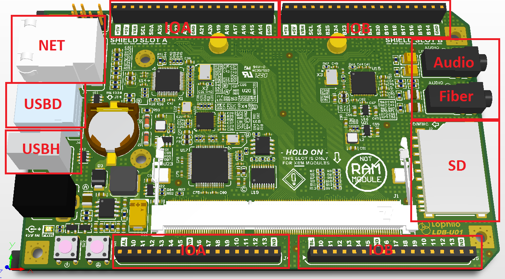

# extention interface

This is the extension IO of the mother broad. The extension IOs are listed as follows:

1. Ethernet
2. USB device
3. USB host
4. SD card
5. Audio
6. S/PDIF
7. LCD interface(in the back end)
7. Programable IO A
8. Programable IO B
